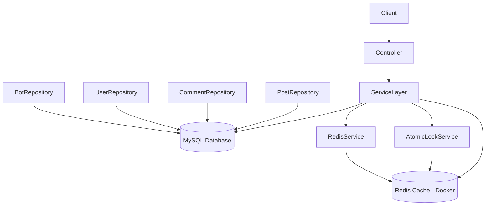

📘 Backend Engineering Assignment
🚀 Project Overview

This project is a high-performance Spring Boot backend system designed to simulate a scalable social interaction platform with real-time processing and strict concurrency control.

It demonstrates core backend engineering concepts such as:

REST API design
Distributed caching
Atomic operations
Concurrency handling
Real-time scoring system
Docker-based service orchestration

The system ensures data consistency, thread safety, and high scalability under heavy concurrent load (bot simulation + user interactions).

🛠️ Tech Stack
Java 
Spring Boot 3.x
MySQL (Dockerized)
Redis (Dockerized)
Spring Data JPA (Hibernate)
Maven
Docker

🧩 System Architecture
⚙️ Architecture Overview

🚀 📌 ARCHITECTURE DIAGRAM 
Mermaid Diagram 

Paste this in your README:

🧠 📌 HOW THIS ARCHITECTURE WORKS
🔹 1. Client Layer
Postman / Frontend / API calls
🔹 2. Controller Layer
Handles HTTP requests
Routes to service layer
🔹 3. Service Layer (CORE LOGIC)
Business logic
Handles:
Virality scoring
Comment/like processing
Bot logic
🔹 4. MySQL (Database)
Stores permanent data:
Posts
Comments
Users
Bots

👉 This is your source of truth

🔹 5. Redis (Docker Container)

Used for:

⚡ Virality scoring
🔒 Atomic locks
⏱ Cooldowns
🚦 Rate limiting

👉 This is your real-time processing engine

🔹 6. AtomicLockService

Handles:

Bot limit (100 per post)
Cooldown (10 min)
Thread safety logic
🔹 7. RedisService

Handles:

Virality score updates
INCR operations

📌 Features Implemented
📝 1. Post Management
Create posts
Stored in MySQL
Timestamp tracking enabled
💬 2. Comment System
Add comments to posts
Supports depth-level tracking (thread structure)
Prevents deep nesting (max depth = 20)
❤️ 3. Like System
Like posts
Updates real-time virality score
🤖 4. Bot Interaction System
Bot replies to posts
Controlled using strict Redis-based rules:
Bot limit per post
Cooldown per bot-human pair
Atomic execution
⚡ Redis Virality Engine

Real-time scoring system that updates engagement instantly.

📊 Scoring Rules
Interaction	Score
Bot Reply	+1
Like	+20
Comment	+50
🔑 Redis Key Format
post:{postId}:virality_score
🔒 Atomic Lock System (CORE FEATURE - PHASE 2)

This system ensures thread safety and prevents race conditions under extreme concurrency load (200+ parallel requests).

🚧 1. Horizontal Bot Limit
Maximum 100 bot replies per post
Redis Key:
post:{postId}:bot_count
✔ Thread Safety:
Uses Redis INCR (atomic operation)
Prevents race conditions under concurrent requests
🚧 2. Cooldown Lock System
Prevents bot-humans repeat interaction within 10 minutes
Redis Key:
cooldown:bot_{botId}:human_{humanId}
✔ Mechanism:
Uses Redis SET NX EX
Ensures atomic lock acquisition
Auto expires after TTL (10 minutes)
🚧 3. Depth Control
Maximum comment depth = 20
Prevents infinite nesting and stack overflow issues
🧠 Thread Safety Guarantee

Thread safety is achieved using Redis as a distributed synchronization layer instead of in-memory Java locks.

✔ Key Principles:
No HashMap or static variables used
Redis handles all shared state
Atomic commands used:
INCR
SET NX EX
Database writes occur only after Redis validation
🚀 Why This is Thread-Safe

Even under extreme load:

✔ No race conditions
✔ No duplicate bot replies
✔ No inconsistent counters
✔ No cooldown bypass
✔ Guaranteed atomic execution

📡 API Endpoints
📝 Create Post
POST /api/posts
💬 Add Comment
POST /api/posts/{postId}/comments
❤️ Like Post
POST /api/posts/{postId}/like
🤖 Bot Reply
POST /api/posts/{postId}/bot/reply
🚀 How to Run Project
1️⃣ Start Redis (Docker)
docker run -p 6379:6379 redis
2️⃣ Start MySQL (Docker or local)

Configure in:

application.properties
3️⃣ Run Spring Boot Application
mvn spring-boot:run

📂 Project Structure
backend-assignment/
│
├── src/
│   ├── main/
│   │   ├── java/com/example/demo/
│   │   │
│   │   │── controller/
│   │   │     ├── PostController.java
│   │   │
│   │   │── service/
│   │   │     ├── PostService.java
│   │   │     ├── RedisService.java
│   │   │     ├── AtomicLockService.java
│   │   │
│   │   │── entity/
│   │   │     ├── Post.java
│   │   │     ├── Comment.java
│   │   │     ├── User.java
│   │   │     ├── Bot.java
│   │   │
│   │   │── repository/
│   │   │     ├── PostRepository.java
│   │   │     ├── CommentRepository.java
│   │   │     ├── UserRepository.java
│   │   │     ├── BotRepository.java
│   │   │
│   │   │── config/
│   │   │     ├── RedisConfig.java   (optional if added)
│   │   │
│   │   │── BackendApiApplication.java
│   │
│   │── resources/
│   │     ├── application.properties
│   │
│
├── docker-compose.yml
├── postman_collection.json
├── README.md
├── pom.xml

🎯 Key Learning Outcomes
Distributed system design using Redis
Real-time scoring engine implementation
Atomic concurrency control mechanisms
Scalable backend architecture
Docker-based development environment
Production-level REST API design

👨‍💻 Author
Pavani

🚀 FINAL NOTE

This project demonstrates a production-grade backend system with Redis-powered concurrency control and real-time processing, capable of handling high-load distributed scenarios safely and efficiently.
